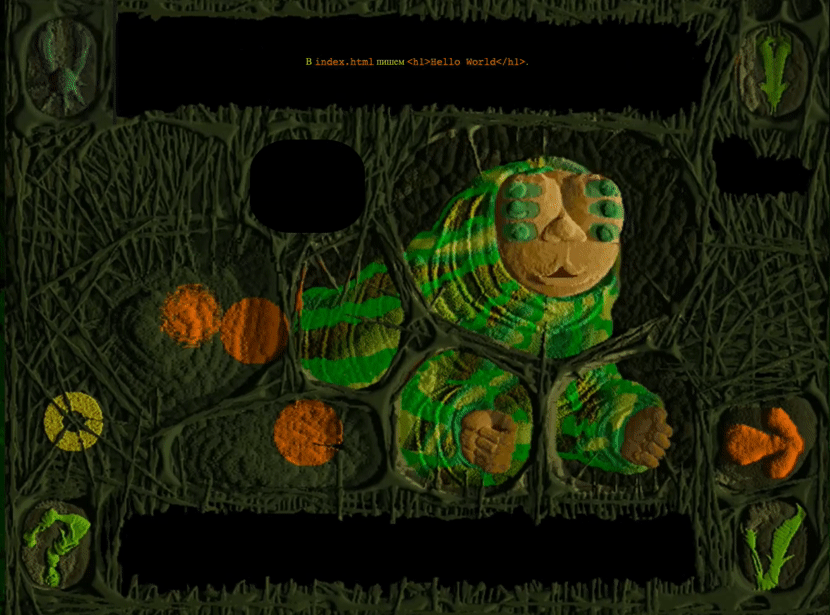
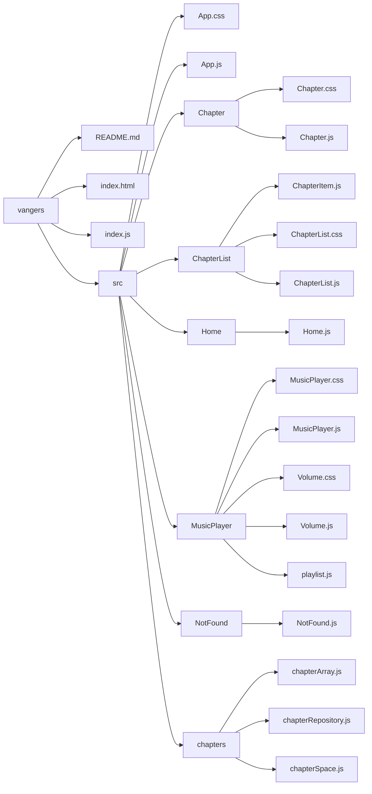

# Vangers
Gamified tutorial for creating a javascript game with physics.



## Website
[https://darthvanger.github.io/vangers-website](https://darthvanger.github.io/vangers-website)

## Run Locally
Run any server, for example
```
npx http-server .
```

## How to add new Chapter
Create `src/chapters/chapterSomething.js` file by analogy with other chapters in the `src/chapters` folder.

Each chapter should have:
* `id` - chapter id for the link, without spaces
* `title` - chapter title for the chapter list - any text
* `steps` - array of objects. Each step object may contain:
  * `text` - text to show in the top panel of the Chapter
  * `code` - code to show at the bottom of the screen
  * `img` - image to show for this step instead of text and code

Open `src/App.js` file and find the `showPage()` function. Inside of it you need to add a new `if () {}`. Use the `id` you used for this chapter in the condition:
```
if (route === '#/chapter/my_chapter_id') { ... }
```

Inside the `if`, assign your chapter to the current page, by analogy with all the other chapters.

## Framework
There is no framework :)

But it is done in React fashion: each component has a folder, js and css file.

For example `Chapter` component folder:
```bash
─── Chapter
    ├── Chapter.css
    └── Chapter.js
```

Each component returns `HTMLElement`.

`App` is the root component, which appends all the other components to itself.

`App` component is also responsible for showing different pages based on `location.hash`.

### Folder Structure
```bash
.
├── README.md
├── index.html # Main html file, all the other pages are in javascript
├── index.js # Main js file, which appends App component to document.body
└── src
    ├── App.css
    ├── App.js # App - root component, it is appended to document.body
    ├── Chapter
    │   ├── Chapter.css
    │   └── Chapter.js # Chapter component - shows chapter page
    ├── ChapterList
    │   ├── ChapterItem.js # ChapterItem - shows link to the chapter on main page
    │   ├── ChapterList.css
    │   └── ChapterList.js # ChapterList - shows list of links to each chapter of the tutorial
    ├── MusicPlayer
    │   ├── MusicPlayer.css
    │   ├── MusicPlayer.js # MusicPlayer - shows music player at the bottom of screen, plays music
    │   ├── Volume.css
    │   ├── Volume.js # Volume - shows volume bar inside of music player, allows changing volume
    │   └── playlist.js # playlist - exports array of tracks for music player
    ├── NotFound
    │   └── NotFound.js # NotFound - not found page to show for bad URLs
    ├── Home
    │   └── Home.js # Home - Home page. It is shown for the "/" route.
    └── chapters # chapters folder - contains each chapter file
        ├── chapterArray.js
        ├── chapterRepository.js
        └── chapterSpace.js
```


